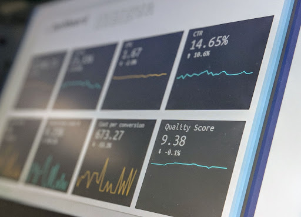

---
seo:
  title: Handle Corrupted Data From Salesforce
  description: This ksqlDB recipe streams changes of Salesforce records and identifies gap events.
---

# Handle corrupted data from Salesforce

Salesforce sends a notification when a change to a Salesforce record occurs as part of a create, update, delete, or undelete operation. However, if there is corrupt data in Salesforce, it sends a gap event instead of a change event, and these gap events should be properly handled to avoid discrepancies between Salesforce reports and internal dashboards. This recipe demonstrates how to process Salesforce data and filter corrupt events, which allows a downstream application to appropriately process and reconcile those events for accurate reporting and analytics.



## Step by step

### Set up your environment

--8<-- "docs/shared/ccloud_setup.md"

### Read the data in

--8<-- "docs/shared/connect.md"

Use Avro so ksqlDB can automatically detect the schema.

```json
--8<-- "docs/real-time-analytics/salesforce/source.json"
```

### Run the stream processing app

--8<-- "docs/shared/ksqlb_processing_intro.md"

```sql
--8<-- "docs/real-time-analytics/salesforce/process.sql"
```

### Cleanup

--8<-- "docs/shared/cleanup.md"
